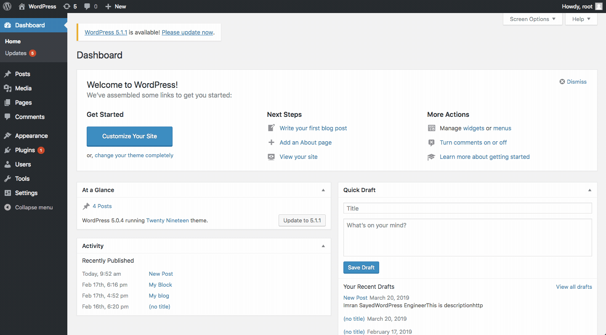

## Description

This plugin adds a simple block in the Gutenberg editor of your WordPress dashboard.
You can add a card called Contact card where you can add your image, description, contact email and social links. 

## Plugin Demo

## Installation

1. Download the zipped plugin. Unzip the plugin. Rename the plugin directory from `cg-blocks-master` to `cg-blocks`.
   Zip the renamed plugin directory
2. Navigate to the __Plugins > Add new__ screen in your WordPress administrative dashboard.
3. Click __Add New__ at the top of the page.
3. Click __Upload Plugin__ at the top of the page.
4. Click __Choose File__, then find and __Upload__ the downloaded renamed zip file.
5. After the plugin finishes installing, click __Activate__.

   or,
   Go to your plugin directory from terminal and Clone this repo in wp-content/plugins directory `git clone https://github.com/imranhsayed/cg-blocks`
   And then activate it from __Plugins__ screen in your WordPress administrative dashboard.
6. Thats it!

## What is included in this plugin ?

- The plugin uses ReactJS & ESNext for creating custom gutenberg block, along with PHP's OOP concept
- It uses Webpack to bundle all of its dependencies into one file index.js
- Has separate stylesheet for front-end & editor.
- Linting Tools used:
- `ESLINT` coding standard configuration.
- `stylelint` configuration.
- `phpcs` for code sniffing. It uses phpcs.xml configuration file.

## How to use ?

- Go to WordPress Dashboard > Posts/Pages > Add New > Add block ( + icon ) > Layout Elements > Contact Card
- Now you can add your picture, name, subtitle, description, twitter link, facebook link and email.
- When you publish the post you can see this custom contact card block as a part of your post/page on dashboard as well as on front end.
- This gutenberg block is reusable so you can use it as many times as you want on a post or page to share your contact details.

